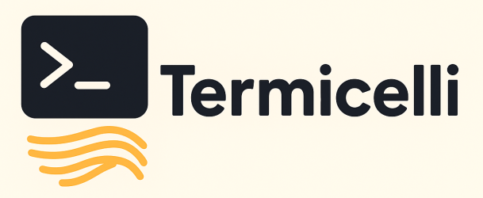
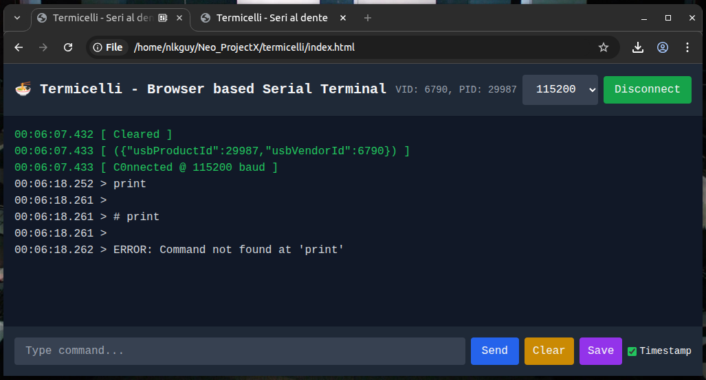

# ⚡ Termicelli

<p align="center">
  
</p>

a sleek browser-based serial terminal powered by the **Web Serial API**.  
Runs fully in the browser - no extra software required.  

---

## ✨ Features
- 🔌 Connect to any serial device via browser
- ⏱️ Real-time terminal output with **precision timestamps**
- 💾 Save terminal output to file
- 🎨 Minimal dark theme interface

---

## 📸 Demo

<p align="center">
  
</p>


---

## 🛠️ Stack
- **Frontend:** Vanilla JavaScript (no frameworkxx)
- **APIs:** Web Serial API
- **UI:** HTML5, CSS3 (dark theme)
- **Deployment:** GitHub Pages (or any static hosting)

---

## 🚀 Usage
1. Open the page in a supported browser (Chrome / Edge).
2. Select a baud rate from the dropdown.
3. Click **Connect** and choose your serial device.
4. View terminal output in real-time.
5. Use toolbar buttons to:
   - **Clear** the terminal
   - **Save** logs
---

## 📦 Deployment
- Clone this repository:
  ```bash
  git clone https://github.com/nlkguy/termicelli.git
